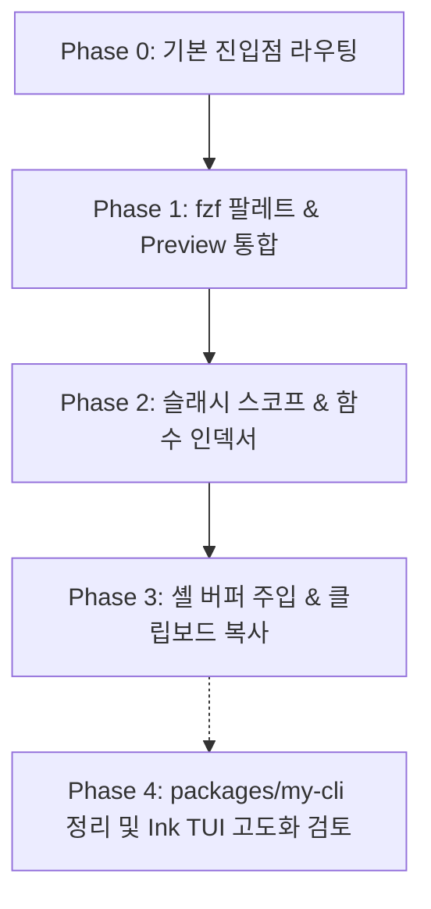

# my-help 명령어 UX 개선 통합 조사 및 종합 제안서

- **문서 위치**: `docs/feature/ux-enhance/my-help-ux-modernization.md`
- **작성일자**: 2026-09-03
- **상태**: Superseded — 결정과 구현은 `docs/feature/ux-enhance/my-help-tui-ux.md` (설계 SSOT) 및 이슈 #1740 이 SSOT 다. 이 문서는 그 결정에 이르는 조사 기록으로 남긴다.
- **로드맵 §5 주의**: 아래 Phase 표기는 이 문서 작성 시점의 제안이며 확정 순서가 아니다. 실제로는 #1740 이 Phase 0~3(진입·preview·슬래시 스코프·함수 registry)과 `packages/my-cli` 삭제를 함께 처리했고(D-2 — 패키지는 삭제, 설계 문서만 `docs/archive/my-cli/` 로 보존), 셸 버퍼 주입·클립보드 복사는 후속 이슈로 분리했다(D-3). "Ink TUI 고도화 검토"는 D-5 의 재개 조건을 만족할 때까지 착수하지 않는다.
- **대상**: `shell-common/functions/my_help.sh`, `docs/archive/my-cli/`
- **검토 및 수용 대상 문서**:
  1. `docs/feature/ux-enhance/my-help-tui-ux.md` (feat-1 브랜치: 실측 데이터, fzf 버전 제약, 고아 packages/my-cli 분석)
  2. `docs/feature/ux-enhance/my-help-command-palette-ux-research.md` (feat-codex-1 브랜치: 5열 TSV 스키마 확장, 읽기 전용 안전성, ZLE 충돌 방지)

---

## 1. 현황 및 실측 데이터 (As-Is)

2026-09-03 기준 실제 저장소 및 환경 수치는 다음과 같습니다.

| 항목 | 실측값 | 근거 | 비고 |
| :--- | :--- | :--- | :--- |
| `my_help.sh` 라인 수 | 1,231줄 | `wc -l shell-common/functions/my_help.sh` | Bash/Zsh 듀얼 호환 |
| 등록된 help 토픽 | 82개 | `HELP_DESCRIPTIONS[...]` 등록 수 | 8개 카테고리 분류 |
| 저장소 내 alias 정의 | 468개 | `grep -rE '^alias [^ =]+=' bash zsh shell-common` | 5열 TSV 인덱스 캐싱 중 |
| 시스템 설치 fzf | **v0.44.1** | `fzf --version` (WSL / Debian) | `reload`, `change-prompt` 지원 / `transform` 미지원 |
| Node.js 런타임 | v26.7.0 | `node --version` | |
| `packages/my-cli` 상태 | **고아(Orphan)** | 2026-02-20 이후 6개월간 방치 | `dist/` 빌드 부재, 절대경로 하드코딩 버그 |

### 1.1 이미 구현되어 있는 핵심 자산 (90% 완성도)
- **카테고리 ↔ 토픽 2단 구조**: `HELP_CATEGORIES`, `HELP_CATEGORY_MEMBERS`, `HELP_COMMAND_TO_CATEGORY` 세 개의 연관 배열이 SSOT로 동작.
- **fzf 퍼지 검색기 내장**: `my-help search` (`find`)를 통해 fzf 검색 지원 (비-TTY/fzf 미설치 시 자동 표 폴백).
- **alias 인덱서 및 캐시 시스템**: 저장소 전체 alias를 스캔하여 5열 TSV(`~/.cache/dotfiles/my-help-alias-index.tsv`, TTL 24h)로 캐싱.
- **동명이의 alias 보존 정책**: 충돌하는 alias(예: `llm-help`)를 임의 삭제하지 않고 모두 유지.

### 1.2 핵심 문제점 및 결핍 요소
1. **검색 기능의 은폐**: `my-help` 실행 시 텍스트 덤프만 발생하며, 대화형 검색은 서브커맨드(`my-help search`)를 외워야만 접근 가능.
2. **미리보기(Preview) 부재**: fzf 목록에서 엔터를 누르기 전까지 정의나 내용을 확인할 수 없어 오탐 시 처음부터 다시 검색해야 함.
3. **Shell Function 인덱싱 부재**: alias만 스캔하고, 실제 사용자가 자주 쓰는 함수(`gh_*`, `gwt`, `devx_*` 등)는 후보에 없음.
4. **`packages/my-cli`의 부채화**: Ink(React) 기반 코드가 있으나 미빌드, 셸 연동 0건, `DOTFILES_ROOT` 미지원 절대경로 존재.

---

## 2. 벤치마크 분석 및 동료 연구 수용 평가

### 2.1 UX 모델 비교

| 모델 | 대표 도구 | 장점 | 단점 | my-help 적합도 |
| :--- | :--- | :--- | :--- | :--- |
| **A. Conversational REPL + Slash Palette** | **Claude Code** | 프롬프트 중심 깔끔함, `/` 입력 즉시 필터링, 키보드 친화적 | 긴 탐색보다는 실행 중심 | **최적 (인터랙션 문법 수용)** |
| **B. Multi-panel Split TUI** | **lazygit** | 실시간 프리뷰, 컨텍스트 단축키(`?`), 패널 조망 | 지속 상태 변경용이라 3초짜리 도움말 뷰어엔 과설계 | **부분 수용 (프리뷰 + 단축키 원칙)** |
| **C. Argument Cheatsheet** | **navi / pet** | 인자 치환 대화형 입력, 셸 버퍼 주입 | 단순 스니펫 위주 | **참고 (향후 확장 기능)** |
| **D. React Ink TUI** | `packages/my-cli` | 유연한 컴포넌트 레이아웃 | Node 콜드스타트(300ms+), 빌드 단계 관리 부채 | **보류 (Phase 2로 유예)** |

### 2.2 동료 연구에서의 핵심 통찰 및 수용 사항

#### [수용 1] ZLE 프롬프트 충돌 방지 (feat-codex-1 제안)
- 셸 프롬프트 자체의 `/` 키를 가로채면 디렉토리 경로(`/usr/bin...`) 입력과 충돌하며 Bash/Zsh 구현 복잡도가 급증함.
- **결정**: `my-help`를 쳤을 때 열리는 **fzf 팔레트 내부의 입력창에서 `/` 문법을 스코프 필터로 동작**시킴.

#### [수용 2] fzf 버전 제약 및 안전한 Preview 구조 (feat-1 제안)
- 현재 호스트 환경의 fzf가 0.44.1이므로 `transform` 등 최신(0.45+) 액션에 의존하지 않고 `change-prompt`, `reload` 위주로 설계.
- fzf preview는 독립 서브셸 프로세스이므로 부모 셸 함수를 직접 읽을 수 없음.
- **결정**: `my-help --preview-entry "<TSV_ROW>"` 형태의 내부 무부작용 CLI 진입점을 통해 preview 렌더링.

#### [수용 3] 안전성 우선 정책 (feat-codex-1 제안)
- 팔레트에서 항목 선택 시 파괴적 명령어(삭제, 푸시 등)가 실수로 자동 실행되는 것을 엄격히 차단.
- **결정**: `Enter`는 "정의/상세 보기(Read-only)", 셸 실행은 사용자가 직접 복사하거나 셸 버퍼에 삽입(`Tab`)한 뒤 명시적으로 수행.

#### [수용 4] 5열 TSV 데이터 계약 확장 (feat-1 & feat-codex-1 제안)
- 기존 alias 인덱스 TSV 스키마를 topic, category, alias, function 전체를 포괄하도록 표준화:
  ```text
  name <TAB> description <TAB> kind <TAB> location <TAB> definition
  ```
- `kind` 값: `topic` | `category` | `alias` | `func`

---

## 3. 권장 아키텍처 및 UX 설계

### 3.1 진입 규칙 (Entrypoint Routing)

| 실행 형태 | TTY + fzf 환경 | Non-TTY (파이프/CI) 또는 fzf 부재 |
| :--- | :--- | :--- |
| `my-help` | **대화형 슬래시 팔레트(TUI) 즉시 실행** | 기존 정적 카테고리 요약표 (하위호환 유지) |
| `my-help search` (`find`) | 대화형 슬래시 팔레트 실행 | 카테고리 요약표 폴백 |
| `my-help <topic> [args]` | 기존 토픽 상세 렌더링 | 동일 |
| `my-help --list` / `--all` | 정적 요약 / 전체 출력 | 동일 |

### 3.2 TUI 인터페이스 레이아웃 (Claude Code 감성 + Lazygit 프리뷰)

```text
┌──────────────────────────────────────────────────────────────────────────────────┐
│ my-help  ›  /all                                82 topics · 468 aliases · 54 funcs│  ← 헤더
├───────────────────────────────────┬──────────────────────────────────────────────┤
│ > /git                            │ # git                                        │
│                                   │                                              │
│ ▶ git        [topic] Git short..  │ Category: development                        │
│   gc         [alias] commit -m    │ Source  : shell-common/functions/git_help.sh │
│   gca        [alias] commit -am   │                                              │
│   gwt        [func]  Git worktree │ ──────────────────────────────────────────── │
│   gbr        [func]  Branch clean │ • Quick Shortcuts:                           │
│   ghes_sync  [func]  Mirror sync  │     gc    git commit -m                      │
│                                   │     gca   git commit --amend                 │
│                                   │     gwt   git worktree management            │
│                                   │                                              │
├───────────────────────────────────┴──────────────────────────────────────────────┤
│ [Enter] Show Detail │ [Tab] Put in Shell │ [Ctrl-Y] Copy │ [?] Help │ [Esc] Quit │  ← 키 힌트
└──────────────────────────────────────────────────────────────────────────────────┘
```

### 3.3 슬래시(`/`) 스코프 필터링 문법

팔레트 입력창에서 검색어 앞에 슬래시를 입력하여 탐색 스코프를 즉시 전환합니다.

| 슬래시 입력 | 스코프 | 검색 대상 |
| :--- | :--- | :--- |
| `/all` (기본값) | 전체 | 토픽 + alias + 함수 전체 통합 퍼지 매칭 |
| `/topic` (또는 `/t`) | Help 토픽 | `HELP_DESCRIPTIONS`에 등록된 공식 도움말 |
| `/alias` (또는 `/a`) | Alias | 저장소 468개 alias 정의 및 주석 |
| `/func` (또는 `/f`) | Shell Function | 공개 셸 함수 (`_`로 시작하는 내부 헬퍼 제외) |
| `/cat [이름]` | 특정 카테고리 | `ai`, `devops`, `cli`, `development` 등 카테고리 멤버 |

### 3.4 키바인딩 (Keymap)

- `Enter`: 선택 항목 상세 조회 (종료 후 스크롤백에 렌더링).
- `Tab`: 선택 항목의 이름(또는 alias 본문)을 터미널 프롬프트 버퍼에 입력하고 종료 (`print -z` / `READLINE_LINE`).
- `Ctrl-Y`: 클립보드로 복사 (`pbcopy`, `wl-copy`, `clip.exe` 감지).
- `Ctrl-O`: 해당 정의 파일의 해당 라인을 `$EDITOR`로 즉시 열기.
- `?`: 현재 스코프 키 힌트 팝업 토글 (lazygit 스타일).
- `Esc`: 출력 없이 깨끗하게 종료.

---

## 4. 데이터 엔진 확장: 함수 인덱서 (`_my_help_build_function_index`)

alias 인덱서 옆에 동일한 구조의 함수 인덱서를 추가합니다.

### 4.1 스캔 대상 및 필터링 규칙
- 대상 디렉토리: `shell-common/functions/`, `shell-common/tools/`, `bash/`, `zsh/`
- 함수 시그니처 정규식: `^[a-zA-Z0-9_-]+\(\)[ \t]*\{`
- **제외 규칙 (노이즈 방지)**:
  - `_`로 시작하는 내부 비공개 함수 제외 (`_my_help_*`, `_ux_*` 등)
  - `*help` 함수는 이미 topic에 포함되므로 `func` 인덱스에서는 중복 배제

### 4.2 캐싱 정책
- 캐시 파일: `${XDG_CACHE_HOME:-$HOME/.cache}/dotfiles/my-help-func-index.tsv`
- 동일한 24시간 TTL 적용 및 원자적(Atomic) 쓰기(temp file -> mv) 보장.

---

## 5. 단계별 구현 로드맵



### Phase 0: 기본 진입점 전환 (Low Risk, High Impact)
- `my_help()` 진입점에서 TTY + fzf 확인 시 `_my_help_search`로 라우팅.
- 비-TTY 및 fzf 미설치 시 기존 정적 요약(`_my_help_show_categories`) 유지.
- 기존 정적 뷰를 원하는 사용자를 위해 `my-help --list` 플래그 제공.

### Phase 1: fzf Preview 및 레이아웃 개선
- `_my_help_search`에 `--height=85%`, `--layout=reverse`, `--preview` 옵션 장착.
- 내부 호출 진입점 `my-help --preview-entry <TSV>` 추가하여 안전한 서브셸 프리뷰 구현.
- `?` 키바인딩으로 프리뷰 토글 지원.

### Phase 2: 슬래시 스코프 및 함수 인덱싱
- `_my_help_build_function_index` 구현 및 TSV 통합 스트림 생성.
- `/alias`, `/func`, `/topic` 등의 쿼리 프리픽스 파싱 및 필터링 지원.

### Phase 3: 키보드 인터랙션 고도화
- `Ctrl-Y` 클립보드 복사 바인딩.
- `Tab` 키로 셸 입력줄에 명령어 주입 (Bash `READLINE_LINE`, Zsh `print -z`).

### Phase 4: `packages/my-cli` 처리
- 현재 방치된 Node.js `packages/my-cli`의 절대경로 버그(`App.tsx`) 수정.
- README에 "실험적(Experimental)" 상태 명시하거나 필요 시 `docs/archive/`로 이관.

---

## 6. 테스트 및 검증 계획

1. **하위 호환성 (Regression Test)**:
   - Bats 테스트: `tests/bats/` 내 기존 `my-help` 관련 테스트 통과 여부.
   - Non-TTY 실행 검증: `my-help | cat` 실행 시 ANSI 코드 없이 깨끗한 텍스트 출력 검증.
2. **Bash / Zsh 듀얼 셸 검증**:
   - Bash 5.x 및 Zsh 5.9 환경에서 배열 처리 및 서브셸 preview 호출 테스트.
3. **오류 안전성 (Fail-Safe)**:
   - 캐시 디렉토리 권한 없음, fzf 미설치, 저장소 파일 손상 시에도 에러 없이 토픽 목록으로 폴백하는지 검증.
